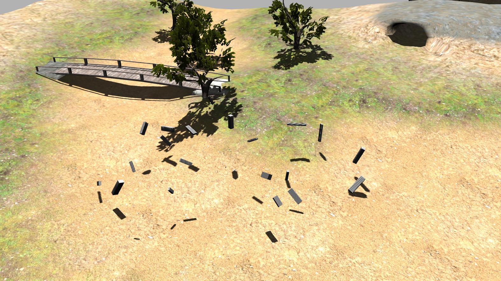

<p align="center">
  
</p>
<p align="center">
  
</p>

# arvc_gazebo_ros_plugins



Este paquete contiene una serie de plugins para insertar y eliminar modelos en entornos de Gazebo. Cada modelo, dispone de múltiples elementos visuales. A cada elemento visual se le puede asociar un valor de modo que los datos obtenidos por un sensor LiDAR quedan etiquetados automáticamente. 

Para ello se hace uso de la propiedad de reflectividad asignada a cada elemento visual de un modelo. 


## Installation

Para poner en funcionamiento este repositorio es necesario otro paquete, formulado como un paquete de ROS, bajo el cual se establece la configuración y los modelos necesarios para generar los datos de forma etiquetada.

En primer lugar será necesario usar ROS. Para el desarrollo de este repositorio se ha empleado ROS Noetic junto con Ubuntu 20.04 y Gazebo en su version 11.4.

En la carpeta correspondiente al "workspace" donde se desee trabajar:

```bash
    # Paquete de configuración 
    git clone https://github.com/Urwik/arvc_dataset_generator.git

    # Paquete con modelos y mundo de ejemplo
    git clone https://github.com/Urwik/arvc_gazebo_models.git
    
    # Paquete actual que contiene los plugins necesarios para la creación de los datos de forma automática
    git clone https://github.com/Urwik/arvc_gazebo_ros_plugins.git
```
    
## Usage/Examples
Para su uso se utiliza el archivo *"dataset_generator_config.yaml"* ubicado en el paquete *"arvc_dataset_generator"* y carpeta *"config"*.

El archivo de configuración se divide en múltiples seciones:
- **simulation**: Contiene los parámetros necesarios para configurar los aspectos generales de la ejecución del plugin, como el modo (paso-a-paso) o si se muestran mensajes por pantalla.
- **sensor**: corresponde a los parámetros para la simulación del sensor, donde es necesario indicar si se quiere insertar en el entorno, su nombre, tópico en el que publica, ruta donde se encuentra su archivo de descripción y el offset o distancia mínima a la que se ha de encontrar de cualquier objeto.
- **

```yaml
# simulation parameters
simulation:
  paused: true  # start the simulation in paused mode (STEP-BY-STEP)
  debug_msgs: false # cout debug messages
  log_msgs: true # enable log messages

# sensor parameters
sensor:
  enable: true # insert the sensor?
  name: "os_128" #sensor_name
  topic: "/os1/pointCloud" #sensor_topic
  path: "/home/arvc/workSpaces/arvc_ws/src/arvc_dataset_generator/models/sensor/model.sdf" #path to the file that describes de sensor
  offset: [1, 1, 1] # offset from which to insert models around the sensor

# camera parameters
camera:
  enable: true  # insert the camera?
  name: "camera" #camera_name
  topic: "/camera/image_raw" #camera_topic
  path: "/home/arvc/workSpaces/arvc_ws/src/arvc_dataset_generator/models/camera/model.sdf" #path to the file that describes de sensor ("sdf", "xacro")

# output data parameters
data:
  enable: true # save data?
  out_dir: "/media/arvc/data/datasets/TEST_GENERATOR" # path to save data
  quantity: 1000 # number of generated scenes
  pc_binary: true # format to save point clouds

# configure world and environment parameters
environment:
  world_model: "world" #path to the world model world_name
  world_name: "world" #world_name
  insert_models: true # insert labeled models
  dynamic_models: true   # move labeled models
  

  # Add each different model you want to insert in the environment as a new "-ID" following the template
  model: 
    - ID: #ID for the model
      type: "environment" 
      name: "plane_0" # name to set to the model
      path: "/home/arvc/workSpaces/arvc_ws/src/arvc_dataset_generator/models/enviroment"  # path to the model
      num_models: 20
      rand_mode: uniform
      min_scale: [1.0, 1.0, 1.0]
      max_scale: [1.0, 1.0, 1.0]
      negative_offset: [-0.5, -0.5, 0.0]
      positive_offset: [0.5, 0.5, 0.0]
      positive_dist: [30.0, 30.0, 30.0]
      negative_dist: [-30.0, -30.0, -30.0]
      rotation_range: [360, 360, 360] 

    - ID: #ID for the model 
      type: "environment" 
      name: "plane_1" # name to set to the model
      path: "/home/arvc/workSpaces/arvc_ws/src/arvc_dataset_generator/models/enviroment"  # path to the model
      num_models: 20
      rand_mode: uniform
      min_scale: [1.0, 1.0, 1.0]
      max_scale: [1.0, 1.0, 1.0]
      negative_offset: [-0.5, -0.5, 0.0]
      positive_offset: [0.5, 0.5, 0.0]
      positive_dist: [30.0, 30.0, 30.0]
      negative_dist: [-30.0, -30.0, -30.0]
      rotation_range: [360, 360, 360]

      
# configure inserted labeled models parameters
labeled_models:
  insert_models: true
  dynamic_models: true

  model: 
    - ID: #ID for the model 
      type: "labeled"
      name: "LAB_0" # name to set to the model
      path: "/home/arvc/workSpaces/arvc_ws/src/arvc_gazebo_models/simple_plane"  # path to the model
      num_models: 20
      rand_mode: uniform
      min_scale: [1.0, 1.0, 1.0]
      max_scale: [1.0, 1.0, 1.0]
      negative_offset: [-0.5, -0.5, 0.0]
      positive_offset: [0.5, 0.5, 0.0]
      positive_dist: [30.0, 30.0, 30.0]
      negative_dist: [-30.0, -30.0, -30.0]
      rotation_range: [360, 360, 360]

    - ID: #ID for the model 
      type: "labeled"
      name: "LAB_1" # name to set to the model
      path: "/home/arvc/workSpaces/arvc_ws/src/arvc_gazebo_models/simple_plane"  # path to the model
      num_models: 20
      rand_mode: uniform
      min_scale: [1.0, 1.0, 1.0]
      max_scale: [1.0, 1.0, 1.0]
      negative_offset: [-0.5, -0.5, 0.0]
      positive_offset: [0.5, 0.5, 0.0]
      positive_dist: [30.0, 30.0, 30.0]
      negative_dist: [-30.0, -30.0, -30.0]
      rotation_range: [360, 360, 360]
```
